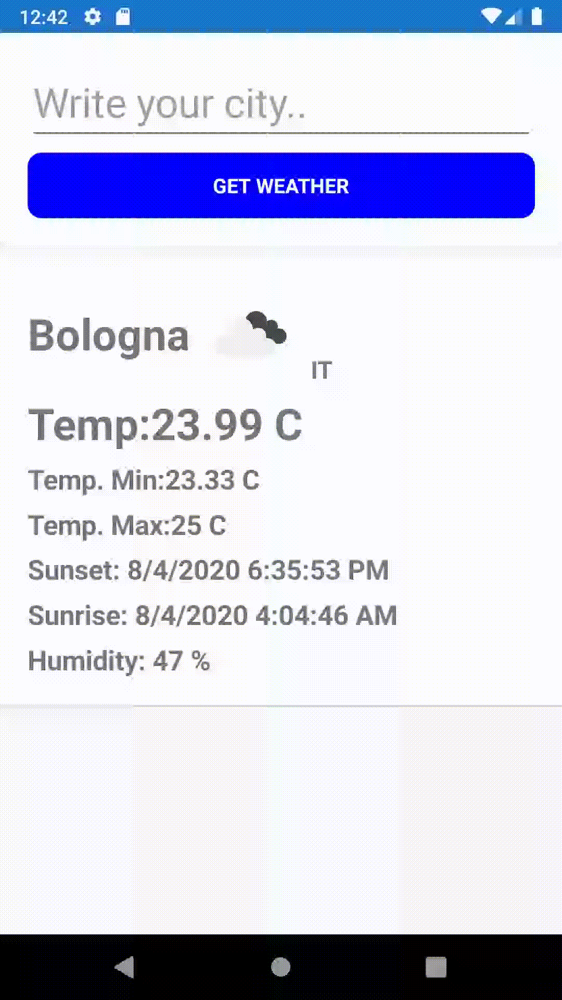

# WeatherApp
WeatherApp demo in XamarinForms! using https://openweathermap.org/

  

#Instrucctions

Go to openweathermap singin or regisrter and get your api key for "Current Weather Data".
Now go to Settings.cs and put your credentials.